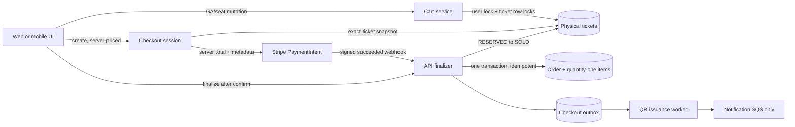

# Ticket inventory, cart, and checkout state

## Authoritative ownership

The database is authoritative for authenticated cart holds, checkout sessions, inventory status,
prices, tax, wallet allocation, orders, and ticket issuance. A browser or mobile client must not
derive sold inventory or decrement availability locally.

One `carts` row owns one physical `tickets` row and always has `quantity = 1`. GA cart responses
group physical rows by `eventId + ticketType`; reserved seats remain individual response lines.
For every ticket group:

```text
totalQuantity = availableQuantity + reservedQuantity + soldQuantity
```

An authenticated cart receives one 15-minute deadline on its first reservation. All later rows
inherit the earliest deadline. Mutations do not extend it. Guest carts in browser/AsyncStorage do
not reserve inventory; the hold begins when the API creates a checkout session.

## Request flow



The client and Stripe webhook invoke the same locked finalizer. A unique PaymentIntent/order link
and checkout-session lock make the race idempotent. The API never reconfirms an intent: it retrieves
and verifies `succeeded`, amount, currency, and `checkout_session_id` metadata.

The legacy amount-only intent, guest-reserve, payment-confirm, and direct order-create endpoints now
return HTTP 410. Order and payment Lambda event-source mappings are disabled. The notification Lambda
remains enabled and receives the existing notification contract from the API outbox after all QR
artifacts for an order are ready.

## React state ownership

| State | Owner |
|---|---|
| Access token and authenticated identity | Auth context; browser storage or mobile SecureStore |
| Theme, language, preferences, recent items | Existing UI contexts and persistent storage |
| Unauthenticated guest cart | Cart facade plus browser localStorage/mobile AsyncStorage |
| Authenticated cart | TanStack Query cache behind the `useCart` facade |
| Ticket types, seats, availability | TanStack Query `event-inventory` query |
| Checkout totals, expiry, payment status, completion | Checkout-session API response/query |
| Checkout form inputs | Local component state |

Event inventory refetches every 15 seconds only while visible and also on focus/reconnect. Successful
and failed cart mutations refetch the authoritative cart and invalidate affected inventory queries.
Web `BroadcastChannel` messages invalidate the same Query keys in other tabs. No UI code performs an
availability decrement.

The API returns `serverTime` with `expiresAt`. Countdown components correct for client clock skew and
use ceiling rounding. Backend expiry uses the `<= now` boundary and UTC serialization ending in `Z`.
Mobile creates a checkout session before opening the browser and passes only the short-lived opaque
resume URL; the resume token is stored by the server only as a SHA-256 hash and is generated with a
server-side HMAC secret.

## Expiry and recovery

Cart reads lazily release a user's due rows. Event inventory reads and the scheduler first expire due
checkout sessions, then atomically release due cart rows. Scheduler queries use bounded
`FOR UPDATE SKIP LOCKED` batches so multiple API instances can run safely. Legacy reservation cleanup
runs last as a compatibility backstop.

If a succeeded payment arrives after cancellation/expiry, or wallet allocation cannot be completed,
the session enters an idempotent compensating-refund path and releases only its captured tickets.
`REFUND_PENDING` is retained for retry/alerting when Stripe refund creation fails.

## Deployment and operations

Apply migrations in order:

1. `V39__physical_cart_reservations.sql` resets invalid multi-quantity rows, normalizes deadlines, and adds the quantity-one constraint.
2. `V40__checkout_sessions.sql` adds session/ticket storage and uniqueness constraints.
3. `V41__checkout_outbox.sql` adds durable, unique issuance/notification events.

Set `CHECKOUT_RESUME_TOKEN_SECRET` to a stable high-entropy secret shared by all API instances. Deploy
the additive API before the clients. After both clients are deployed, drain/archive the old order and
payment queues, confirm their Lambda mappings are disabled, and monitor orphan holds, cart/ticket
count mismatches, duplicate payment links, refund failures, and outbox retry counts.
