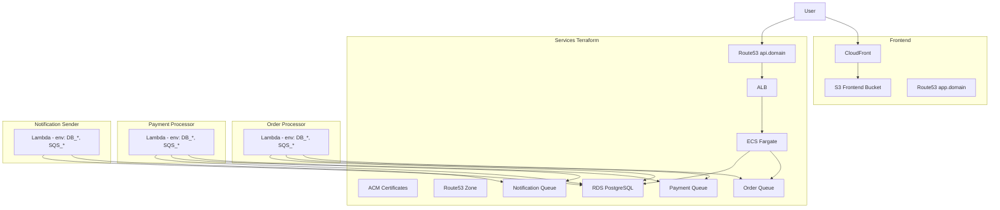

# Microservices Terraform Refactoring Plan

> Current architecture update: `backend/shared-infra` is now the sole upstream Terraform state for services, frontend, and lambdas. Shared resources such as RDS, SQS, event-images S3, Route53 hosted-zone outputs, ACM certificates, and shared security groups are owned by `backend/shared-infra` and consumed through `shared-infra/terraform.tfstate`, not `services/terraform.tfstate`.

Refactor the EventPro application into independently deployable microservices with Terraform colocated in each component (frontend, services, lambdas). Remove the shared module dependency by inlining data structures into each service.

---

## How to Use This Plan

**Work one phase at a time.** Complete each phase fully before starting the next. Each phase has prerequisites, scope, deliverables, and a "Done when" checklist.

| Phase | Name | Prerequisites | Start when |
|-------|------|---------------|------------|
| **0** | Prerequisites | None | Ready now |
| **1** | Services Terraform | Phase 0 | Docker + terraform actions work (S3 state bucket already exists) |
| **2** | Frontend Terraform | Phase 1 | Services applied; outputs available |
| **3** | Order-processor Terraform | Phase 1 | Services applied |
| **4** | Payment-processor Terraform | Phase 1 | Services applied |
| **5** | Notification-sender Terraform | Phase 1 | Services applied |
| **6** | Shared module removal | Phases 1–5 | All Terraform + workflows complete |

**Execution order**: Phase 0 → Phase 1 → (Phases 2, 3, 4, 5 in any order after 1) → Phase 6.

**Start here**: Phase 0 (Prerequisites). Work through the "Done when" checklist before moving on.

---

## Design Decisions
- **No foundation layer**: ACM and Route53 are managed by services Terraform.
- **Default VPC**: Use AWS default VPC; no custom VPC creation.
- **RDS & SQS**: Created by services Terraform (`backend/services/terraform/`).
- **Lambdas**: Receive database and queue connection information via environment variables (injected from services Terraform outputs).
- **ECR repositories**: Pre-existing; passed in via variables (not created by component Terraform).
- **No shared modules**: Each component uses inline `resource` blocks; no `infrastructure/modules/`. Services own RDS, SQS, ALB, Route53, ECS; frontend owns S3, CloudFront; each lambda defines its own Lambda resource.
- **Terraform workspaces**: Use `terraform workspace` for multi-environment deployment. Resource names: `${terraform.workspace}-<resource-name>`. All resources tagged with `Env = terraform.workspace`. Route53 aliases: `${terraform.workspace}-app`, `${terraform.workspace}-api` to avoid DNS clashes.
- **Providers**: Use latest Terraform and AWS provider (see Terraform Provider Versions below).

---

## Current State Summary

- **Monolithic Terraform**: All resources in `infrastructure/environments/dev/main.tf` (VPC, RDS, S3, SQS, CloudFront, ECS, ALB, Lambdas, Route53). **Refactor**: Use default VPC; RDS and SQS move to services Terraform.
- **Shared module**: `backend/shared/` used by services and all Lambdas for entities, enums, DTOs (OrderMessage, PaymentMessage, NotificationMessage), exceptions, utils
- **Frontend**: Uses `VITE_API_BASE_URL` in `eventpro-frontend/src/lib/api.ts` (defaults to `http://localhost:8080`)
- **Build**: Docker images built from `backend/` context; services and Lambdas both copy `shared/` into image
- **S3 + CloudFront**: Dev config uses OAC but S3 frontend bucket may lack the required bucket policy for CloudFront OAC access

---

## Target Architecture

- **Default VPC**: Use AWS default VPC (no custom VPC creation).
- **RDS & Queues**: Created by services Terraform; connection details passed to Lambdas via environment variables.
- **ECR**: Repositories already exist; image URIs passed in via variables.
- **Workspaces**: `dev`, `staging`, `prod` (or similar); resource names and tags use `${terraform.workspace}`. Route53 aliases use workspace in subdomain (e.g. `dev-app`, `dev-api`) to avoid clashes.



---

## Terraform Provider Versions

Use latest stable versions. Consult [Terraform Registry](https://registry.terraform.io/providers/hashicorp/aws/latest) for current versions.

**`versions.tf`** (in each component's terraform directory):

```hcl
terraform {
  required_version = ">= 1.9.0"

  required_providers {
    aws = {
      source  = "hashicorp/aws"
      version = "~> 5.57"   # Use latest 5.x; check registry for current
    }
  }

  backend "s3" {
    bucket         = "eventpro-site-state"
    key            = "<component>/terraform.tfstate"   # frontend, services, order, payment, notification
    region         = "us-east-1"
    use_lockfile = true
  }
}
```

**Components and keys**:
| Component | Backend key |
|-----------|-------------|
| Frontend | `frontend/terraform.tfstate` |
| Services | `services/terraform.tfstate` |
| Order-processor | `order/terraform.tfstate` |
| Payment-processor | `payment/terraform.tfstate` |
| Notification-sender | `notification/terraform.tfstate` |

---

## Terraform Workspace Conventions

Use `terraform workspace select <env>` (or `terraform workspace new <env>`) to deploy to different environments. Each component uses the same workspace pattern.

**Resource naming**:
- Prefix all resource names with `${terraform.workspace}`: e.g. `"${terraform.workspace}-eventpro-frontend-bucket"`, `"${terraform.workspace}-eventpro-order-queue"`
- Use: `name = "${terraform.workspace}-<descriptive-name>"` (or `name_prefix` where supported)

**Tagging**:
- Add to every resource: `tags = { Env = terraform.workspace }` (or merge with component-specific tags)
- Example: `tags = merge(var.tags, { Env = terraform.workspace })`

**Route53 records**: Include workspace in DNS names to avoid clashes across environments. Use subdomains like `${terraform.workspace}-app.${var.domain_name}` and `${terraform.workspace}-api.${var.domain_name}` (e.g. `dev-app.example.com`, `dev-api.example.com`). Each workspace gets distinct A/alias records.

**Workspace names**: `default` (or `dev`), `staging`, `prod`—ensure CI/CD selects the correct workspace before apply.

**State backend** (bucket already exists):
- Bucket: `eventpro-site-{project}` (e.g. `eventpro-site-state`)
- Keys (one per component):
  - `frontend/terraform.tfstate`
  - `services/terraform.tfstate`
  - `order/terraform.tfstate`
  - `payment/terraform.tfstate`
  - `notification/terraform.tfstate`
- Each component's `backend` block: `bucket = "eventpro-site-state"`, `key = "<component>/terraform.tfstate"`

---

## Phase 0: Prerequisites

**Scope**: Shared infrastructure and actions needed by all components. Do this first.

**Tasks**:

1. **S3 state bucket** – Already exists (`eventpro-site-state` or `eventpro-site-{project}`). Use `use_lockfile = true` in backend for state locking (no DynamoDB). No creation needed.
2. **Docker action** – Implement `.github/actions/docker/action.yml`: ECR login, build, tag, push. Inputs: `ecr-repository`, `image-tag`, `context`, `dockerfile`.
3. **Terraform action** – Update `.github/actions/terraform/action.yml`: require `workspace`; add backend config for S3 bucket/key; terraform version `>= 1.9`.
4. **Deploy workflow** – Update `.github/workflows/deploy.yml`: path filters for `frontend`, `services`, `order-processor`, `payment-processor`, `notification-sender`.

**Done when**:
- [ ] `terraform action` runs successfully with workspace + backend (bucket already exists)
- [ ] `docker action` builds and pushes an image to ECR
- [ ] `deploy.yml` detects changes correctly

---

## Phase 1: Services Terraform Configuration

**Path**: `backend/services/terraform/` (colocated with services code)

**Prerequisites**: Phase 0 complete.

**Scope**: Create the root Terraform config (ACM, Route53, RDS, SQS, ALB, ECS). No dependencies on other components.

**Resources** (inline `resource` blocks—no modules):

- **ACM certificates** (for CloudFront and ALB)
- **Route53 zone** (create or data source)
- **RDS** – `aws_db_instance`, `aws_secretsmanager_secret`, etc. in default VPC
- **SQS queues** – `aws_sqs_queue` for order, payment, notification
- **ALB** – `aws_lb`, `aws_lb_listener`, `aws_lb_target_group`
- **ECS** – `aws_ecs_cluster`, `aws_ecs_service`, `aws_ecs_task_definition` using default VPC subnets
- **Route53** – `aws_route53_record` for `${terraform.workspace}-api.${var.domain_name}` as alias to ALB (workspace in subdomain to avoid clashes)
- **IAM** – Task role with policies for SQS, S3 (images bucket), Secrets Manager, SES, SNS
- **Security groups** – RDS, ECS, ALB (in default VPC)

**Workspace**: Resource names `${terraform.workspace}-<name>`; tags `Env = terraform.workspace` on all resources.

**Default VPC usage**:

- Data source: `data "aws_vpc" "default"` and `data "aws_subnets" "default"`
- RDS, ECS, ALB, Lambdas all use default VPC subnets

**Outputs** (for Lambdas and Frontend via `terraform_remote_state`):

- `rds_endpoint`, `rds_port`, `rds_name`, `db_master_user_secret_arn`
- `order_queue_url`, `order_queue_arn`, `payment_queue_url`, `payment_queue_arn`, `notification_queue_url`, `notification_queue_arn`
- `rds_security_group_id` (for Lambda VPC config if needed)
- `route53_zone_id`, `cloudfront_certificate_arn`, `alb_certificate_arn`

**Environment variables** (for ECS tasks):

- `SPRING_PROFILES_ACTIVE`, `DB_HOST`, `DB_PORT`, `DB_NAME`, `DB_SECRET_ARN`, `AWS_REGION`
- `ORDER_QUEUE_URL`, `PAYMENT_QUEUE_URL`, `NOTIFICATION_QUEUE_URL`
- `STRIPE_*`, `S3_BUCKET_NAME`, `JWT_*`

**Variables**: `ecr_api_image_uri` (pre-existing ECR repository image URI for the API service)

**Implementation**: All resources defined inline in `main.tf` (or split across `rds.tf`, `sqs.tf`, `alb.tf`, `ecs.tf`, `route53.tf` as needed)—no modules.

**Deliverables**:
- [ ] `backend/services/terraform/` with `versions.tf`, `variables.tf`, `outputs.tf`, `main.tf` (or split files)
- [ ] `terraform init` and `terraform apply` succeed
- [ ] Outputs: `rds_endpoint`, queue URLs, `route53_zone_id`, `cloudfront_certificate_arn`, `alb_certificate_arn`
- [ ] `services.yml` workflow runs: build → docker → terraform (with workspace, AWS creds, `ecr_api_image_uri`)

**Done when**: Services infra is live; `terraform output` returns all required values for frontend and lambdas.

---

## Phase 2: Frontend Terraform Configuration

**Path**: `eventpro-frontend/terraform/` (colocated with frontend code)

**Prerequisites**: Phase 1 complete (need `route53_zone_id`, `cloudfront_certificate_arn` from services).

**Resources**:
- S3 bucket for frontend static assets (with Block Public Access enabled)
- CloudFront Origin Access Control (OAC)
- CloudFront distribution with S3 origin
- S3 bucket policy allowing CloudFront OAC (via `AWS:SourceArn` condition)
- Route53 A record: `${terraform.workspace}-app.${var.domain_name}` as alias to CloudFront (workspace in subdomain to avoid clashes)

**Build and deploy**: `npm run build` → `aws s3 sync dist/ s3://${bucket-name}/` → CloudFront invalidation.

**Environment variables for frontend build**: Inject `VITE_API_BASE_URL=https://${terraform.workspace}-api.${var.domain_name}` at build time.

**Variables**: `domain_name`, `name_prefix`, `cloudfront_certificate_arn`, `route53_zone_id` (via `terraform_remote_state` from services).

**Implementation**: Inline `resource` blocks for `aws_s3_bucket`, `aws_cloudfront_distribution`, `aws_cloudfront_origin_access_control`, `aws_route53_record`—no modules.

**Workspace**: Resource names `${terraform.workspace}-<name>`; tags `Env = terraform.workspace`.

**Deliverables**:
- [ ] `eventpro-frontend/terraform/` with terraform files
- [ ] `terraform apply` succeeds
- [ ] `frontend.yml` workflow: build with `VITE_API_BASE_URL`, terraform, S3 sync, CloudFront invalidation

**Done when**: Frontend is deployed; app loads from workspace-specific URL.

---

## Phase 3: Order-Processor Terraform Configuration

**Path**: `backend/lambdas/order-processor/terraform/` (colocated with lambda code)

**Prerequisites**: Phase 1 complete (need DB/queue URLs from services).

**Resources** (inline `resource` blocks—no modules):

- `aws_lambda_function` (container image) with `aws_lambda_event_source_mapping` from order queue
- `aws_iam_role` for `lambda.amazonaws.com` + VPC execution (default VPC), SQS receive/delete, SQS send to payment queue, Secrets Manager (DB)

**Environment variables** (injected from services Terraform outputs via `terraform_remote_state`):

- `DB_HOST`, `DB_PORT`, `DB_NAME`, `DB_SECRET_ARN`, `AWS_REGION`
- `ORDER_QUEUE_URL`, `SQS_PAYMENT_QUEUE_URL`

Lambda expects all database and queue connection information via environment variables—no hardcoded endpoints.

**Variables**: `ecr_order_processor_image_uri` (pre-existing ECR image URI)

**Workspace**: Resource names `${terraform.workspace}-<name>`; tags `Env = terraform.workspace`.

**Deliverables**:
- [ ] `backend/lambdas/order-processor/terraform/` with terraform files
- [ ] `terraform apply` succeeds
- [ ] `order-processor.yml`: fix `working-directory` to `backend/lambdas/order-processor/terraform`; add terraform inputs (workspace, AWS creds, `ecr_order_processor_image_uri`)

**Done when**: Order-processor Lambda is deployed and triggered by order queue.

---

## Phase 4: Payment-Processor Terraform Configuration

**Path**: `backend/lambdas/payment-processor/terraform/` (colocated with lambda code)

**Prerequisites**: Phase 1 complete (need DB/queue URLs from services).

**Resources** (inline `resource` blocks—no modules):

- `aws_lambda_function` (container image) with `aws_lambda_event_source_mapping` from payment queue
- `aws_iam_role` for VPC (default), SQS, Secrets Manager, Stripe (via env or Secrets Manager)

**Environment variables** (injected from services Terraform outputs):

- `DB_HOST`, `DB_PORT`, `DB_NAME`, `DB_SECRET_ARN`, `AWS_REGION`
- `PAYMENT_QUEUE_URL`, `SQS_NOTIFICATION_QUEUE_URL`
- `STRIPE_SECRET_KEY` (or Secrets Manager ARN)

Lambda expects all database and queue connection information via environment variables.

**Variables**: `ecr_payment_processor_image_uri` (pre-existing ECR image URI)

**Workspace**: Resource names `${terraform.workspace}-<name>`; tags `Env = terraform.workspace`.

**Deliverables**:
- [ ] `backend/lambdas/payment-processor/terraform/` with terraform files
- [ ] `terraform apply` succeeds
- [ ] `payment-processor.yml`: add terraform inputs (workspace, AWS creds, `ecr_payment_processor_image_uri`)

**Done when**: Payment-processor Lambda is deployed and triggered by payment queue.

---

## Phase 5: Notification-Sender Terraform Configuration

**Path**: `backend/lambdas/notification-sender/terraform/` (colocated with lambda code)

**Prerequisites**: Phase 1 complete (need DB/queue URLs from services).

**Resources** (inline `resource` blocks—no modules):

- `aws_lambda_function` (container image) with `aws_lambda_event_source_mapping` from notification queue
- `aws_iam_role` for VPC (default), SQS, Secrets Manager, SES, SNS

**Environment variables** (injected from services Terraform outputs):

- `DB_HOST`, `DB_PORT`, `DB_NAME`, `DB_SECRET_ARN`, `AWS_REGION`
- `NOTIFICATION_QUEUE_URL`
- `SES_SENDER_EMAIL`

Lambda expects all database and queue connection information via environment variables.

**Variables**: `ecr_notification_sender_image_uri` (pre-existing ECR image URI)

**Workspace**: Resource names `${terraform.workspace}-<name>`; tags `Env = terraform.workspace`.

**Deliverables**:
- [ ] `backend/lambdas/notification-sender/terraform/` with terraform files
- [ ] `terraform apply` succeeds
- [ ] `notification-sender.yml`: fix `working-directory` to `backend/lambdas/notification-sender/terraform`; add terraform inputs

**Done when**: Notification-sender Lambda is deployed and triggered by notification queue.

---

## Phase 6: Remove Shared Module Dependency

**Prerequisites**: Phases 1–5 complete (all Terraform and workflows working).

**Scope**: Remove `backend/shared` dependency from services and lambdas. Copy/inline only what each service needs. Accept duplication for separation.

### Services (Spring Boot)

| Shared Item | Action |
|-------------|--------|
| `OrderMessage`, `PaymentMessage`, `NotificationMessage` | Copy into `eventpro-core` (or `eventpro-order` for OrderMessage) under `com.accessplus.eventpro.core.messaging.model` |
| `OrderEntity`, `OrderItemEntity`, `TicketEntity`, `BaseEntity` | Keep in services (they own the schema). Move from shared to `eventpro-order` / `eventpro-event` |
| `OrderStatus`, `TicketStatus`, `TicketType`, `EventStatus`, `NotificationType`, `NotificationDeliveryType` | Copy into respective modules (`eventpro-order`, `eventpro-event`, `eventpro-payment`) |
| `DatabaseSecretParser`, `UuidUtils`, `StringUtils`, `DateUtils` | Copy into `eventpro-core` util package |
| `ValidationException`, `ResourceNotFoundException`, etc. | Copy into `eventpro-core` exception package |

### Order-Processor Lambda

| Shared Item | Action |
|-------------|--------|
| `OrderMessage`, `PaymentMessage` | Create `com.accessplus.eventpro.order.model` in lambda |
| `OrderEntity`, `OrderItemEntity`, `TicketEntity`, `BaseEntity` | Create local entities (same schema, same DB tables) in `com.accessplus.eventpro.order.entity` |
| `OrderStatus`, `TicketStatus`, `TicketType` | Create local enums |
| `DatabaseSecretParser` | Copy or inline minimal parsing logic |

### Payment-Processor Lambda

| Shared Item | Action |
|-------------|--------|
| `PaymentMessage`, `NotificationMessage` | Create local models |
| `OrderEntity`, `OrderItemEntity`, `TicketEntity` | Create local entities |
| `OrderStatus`, `TicketStatus`, `NotificationType`, `NotificationDeliveryType` | Create local enums |
| `DatabaseSecretParser` | Copy |

### Notification-Sender Lambda

| Shared Item | Action |
|-------------|--------|
| `NotificationMessage` (incl. `NotificationPayload`) | Create local model |
| Entities if needed for in-app notifications | Create local entities |
| `NotificationType`, `NotificationDeliveryType` | Create local enums |

### Build Changes

- **Services**: Remove `includeBuild '../shared'` from `backend/services/settings.gradle`; remove `implementation 'com.accessplus.eventpro:eventpro-shared:1.0.0'` from all service module `build.gradle` files
- **Lambdas**: Remove `includeBuild '../../shared'` from each lambda `settings.gradle`; remove shared dependency from `build.gradle`
- **Dockerfiles**: Remove `COPY shared ./shared` from `backend/services/Dockerfile` and each `backend/lambdas/*/Dockerfile`
- **Lambda Gradle**: Each lambda needs its own `settings.gradle` without composite build; add local `entity`, `model`, `enums` packages

### Shared Folder

- **Do not delete** (per user request). It remains in the repo but is no longer referenced. Can add a README noting it is deprecated.

**Deliverables**:
- [ ] Services: remove `includeBuild '../shared'`; copy entities/models into `eventpro-core`; remove shared from Dockerfile
- [ ] Lambdas: remove `includeBuild '../../shared'`; add local `entity`, `model`, `enums` packages; remove shared from Dockerfiles
- [ ] All builds pass without shared

**Done when**: No component references `backend/shared`; builds and deploys succeed.

---

## Terraform Directory Structure

**Colocated Terraform**: Each component owns its Terraform configuration with inline `resource` blocks. No shared modules.

```
eventpro-frontend/
├── src/
├── terraform/            # S3, CloudFront, Route53 (inline resources)
│   ├── main.tf
│   ├── variables.tf
│   ├── outputs.tf
│   └── versions.tf
└── ...

backend/
├── services/
│   ├── modules/
│   ├── terraform/        # ACM, Route53, RDS, SQS, ALB, ECS (inline resources; ECR via var)
│   │   ├── main.tf       # or split: rds.tf, sqs.tf, alb.tf, ecs.tf, route53.tf
│   │   ├── variables.tf
│   │   ├── outputs.tf
│   │   └── versions.tf
│   └── ...
└── lambdas/
    ├── order-processor/
    │   ├── src/
    │   ├── terraform/    # Lambda, IAM (inline resources; ECR image URI via var)
    │   │   ├── main.tf
    │   │   ├── variables.tf
    │   │   └── outputs.tf
    │   └── ...
    ├── payment-processor/
    │   ├── terraform/
    │   └── ...
    └── notification-sender/
        ├── terraform/
        └── ...
```

**Benefits**:

- **Simplicity**: No module indirection; each component is self-contained with direct resource definitions
- **Isolation**: Frontend changes don't touch backend terraform
- **Ownership**: Teams work within their component directory
- **CI/CD**: Each pipeline runs `terraform` from its component's `terraform/` folder

**State management**: S3 backend bucket `eventpro-site-state` (already exists) with keys `frontend/terraform.tfstate`, `services/terraform.tfstate`, `order/terraform.tfstate`, `payment/terraform.tfstate`, `notification/terraform.tfstate`. Services Terraform is the root—it contains ACM, Route53, RDS, SQS, and outputs them. Frontend and Lambdas reference services via `terraform_remote_state` to obtain `route53_zone_id`, `cloudfront_certificate_arn`, and DB/queue URLs. Use the same workspace when reading remote state (e.g. `terraform_remote_state` from services in `dev` workspace).

---

## Implementation Order (Quick Reference)

| # | Phase | Focus |
|---|-------|-------|
| 0 | Prerequisites | Docker action, terraform action, deploy.yml path filters (S3 state bucket exists) |
| 1 | Services | `backend/services/terraform/` – ACM, Route53, RDS, SQS, ALB, ECS |
| 2 | Frontend | `eventpro-frontend/terraform/` – S3, CloudFront, Route53 |
| 3 | Order-processor | `backend/lambdas/order-processor/terraform/` – Lambda + IAM |
| 4 | Payment-processor | `backend/lambdas/payment-processor/terraform/` – Lambda + IAM |
| 5 | Notification-sender | `backend/lambdas/notification-sender/terraform/` – Lambda + IAM |
| 6 | Shared removal | Remove shared from services and lambdas; copy/inline code |

---

## GitHub Actions Workflows

Complete the workflows for each phase. Current state: `deploy.yml` (path filters), `services.yml`, `frontend.yml`, `order-processor.yml`, `payment-processor.yml`, `notification-sender.yml`, and actions: `terraform`, `gradle-task`, `docker`.

### Workflow completion by phase

| Phase | Workflow | Tasks to complete |
|-------|----------|-------------------|
| **0** | `deploy.yml` | Path filters for `frontend`, `services`, `order-processor`, `payment-processor`, `notification-sender` |
| **1** | `services.yml` | Terraform inputs: `workspace`, AWS creds, `ecr_api_image_uri`; docker action builds/pushes |
| **2** | `frontend.yml` | Fix trigger; `VITE_API_BASE_URL` from workspace; S3 sync + CloudFront invalidation; terraform with `workspace`, AWS creds |
| **3** | `order-processor.yml` | **Fix**: `working-directory` → `backend/lambdas/order-processor/terraform`; terraform inputs |
| **4** | `payment-processor.yml` | Terraform inputs: `workspace`, AWS creds, `ecr_payment_processor_image_uri` |
| **5** | `notification-sender.yml` | **Fix**: `working-directory` → `backend/lambdas/notification-sender/terraform`; terraform inputs |

### Deploy workflow (`deploy.yml`)

- Update `detect-changes` outputs to match: `frontend`, `services`, `order-processor`, `payment-processor`, `notification-sender` (replace `shared`, `lockbox-gateway`, etc.)
- Path filters: `eventpro-frontend/**`, `backend/services/**`, `backend/lambdas/order-processor/**`, etc.
- Add jobs that call component workflows or run terraform conditionally: `if: needs.detect-changes.outputs.services == 'true'`
- Orchestrate: services first, then frontend and lambdas (or run in parallel if dependencies handled via remote state)

### Actions to implement

| Action | Path | Tasks |
|--------|------|-------|
| **docker** | `.github/actions/docker/action.yml` | Implement: build Docker image, tag, push to ECR; inputs: `ecr-repository`, `image-tag`, `context`, `dockerfile`; use `aws-actions/amazon-ecr-login` |
| **terraform** | `.github/actions/terraform/action.yml` | Add backend init with `-backend-config` for S3 bucket/key; ensure `workspace` is required and passed; update terraform version to `>= 1.9`; add `terraform plan` before apply (optional) |

### Required secrets

- `AWS_ACCESS_KEY_ID`, `AWS_SECRET_ACCESS_KEY` (or use OIDC with `aws-actions/configure-aws-credentials`)
- `ECR_API_IMAGE_URI`, `ECR_ORDER_PROCESSOR_IMAGE_URI`, etc. (or derive from ECR after push)

### Workflow execution order

1. **Services** – Must run first (root); outputs consumed by others
2. **Frontend** – Depends on services for `route53_zone_id`, `cloudfront_certificate_arn`
3. **Lambdas** – Depends on services for DB/queue URLs; can run in parallel after services

---

## Key Files to Modify

| File | Changes |
|------|---------|
| `eventpro-frontend/vite.config.ts` | Ensure `VITE_API_BASE_URL` is loadable; document build-time injection |
| `eventpro-frontend/src/lib/api.ts` | Already uses `VITE_API_BASE_URL`; no change |
| `backend/services/settings.gradle` | Remove `includeBuild '../shared'` |
| `backend/services/modules/*/build.gradle` | Remove shared dependency; add local modules for entities/models |
| `backend/services/Dockerfile` | Remove `COPY shared` |
| `backend/lambdas/*/settings.gradle` | Remove `includeBuild '../../shared'` |
| `backend/lambdas/*/build.gradle` | Remove shared dependency |
| `backend/lambdas/*/Dockerfile` | Remove `COPY shared` |
| `infrastructure/environments/dev/main.tf` | Deprecate or refactor; RDS/SQS move to services; no modules; use default VPC |
| `.github/workflows/deploy.yml` | Update path filters to `frontend`, `services`, `order-processor`, `payment-processor`, `notification-sender`; add conditional jobs |
| `.github/workflows/services.yml` | Add terraform action inputs (workspace, AWS creds, variables) |
| `.github/workflows/frontend.yml` | Fix trigger; add S3 sync + CloudFront invalidation; pass `VITE_API_BASE_URL` |
| `.github/workflows/order-processor.yml` | Fix deploy `working-directory` to `backend/lambdas/order-processor/terraform` |
| `.github/workflows/notification-sender.yml` | Fix deploy `working-directory` to `backend/lambdas/notification-sender/terraform` |
| `.github/actions/docker/action.yml` | Implement: ECR login, build, push |
| `.github/actions/terraform/action.yml` | Add backend config; ensure workspace required |

---

## Open Questions

1. **Terragrunt vs Terraform**: Use Terragrunt for `dependency` blocks and DRY `terraform_remote_state`, or plain Terraform with explicit data sources?
2. **CI/CD**: Should the plan include GitHub Actions / GitLab CI pipelines for build + deploy per component?
3. **Images bucket**: The S3 images bucket is used by ECS (services). Should it live in services Terraform alongside RDS and SQS?
4. **Default VPC limits**: Default VPC has limited subnet availability per AZ. Confirm default VPC exists and has sufficient capacity for RDS, ECS, and Lambdas in the target region.
